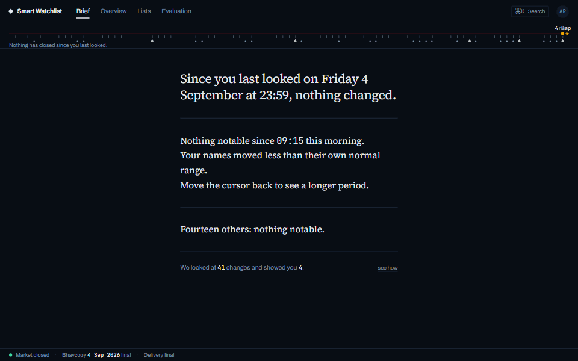
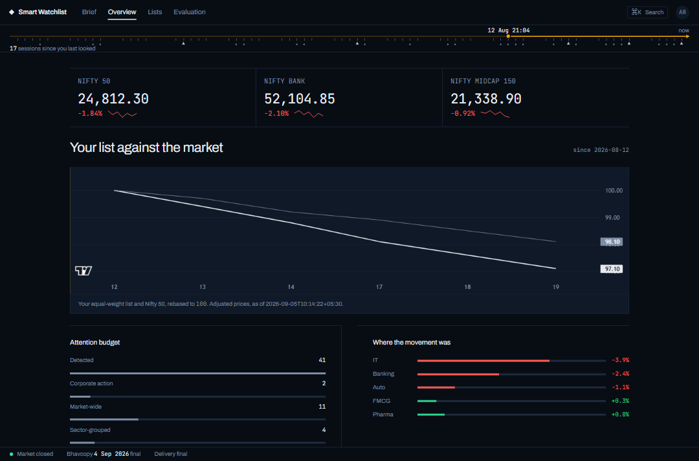
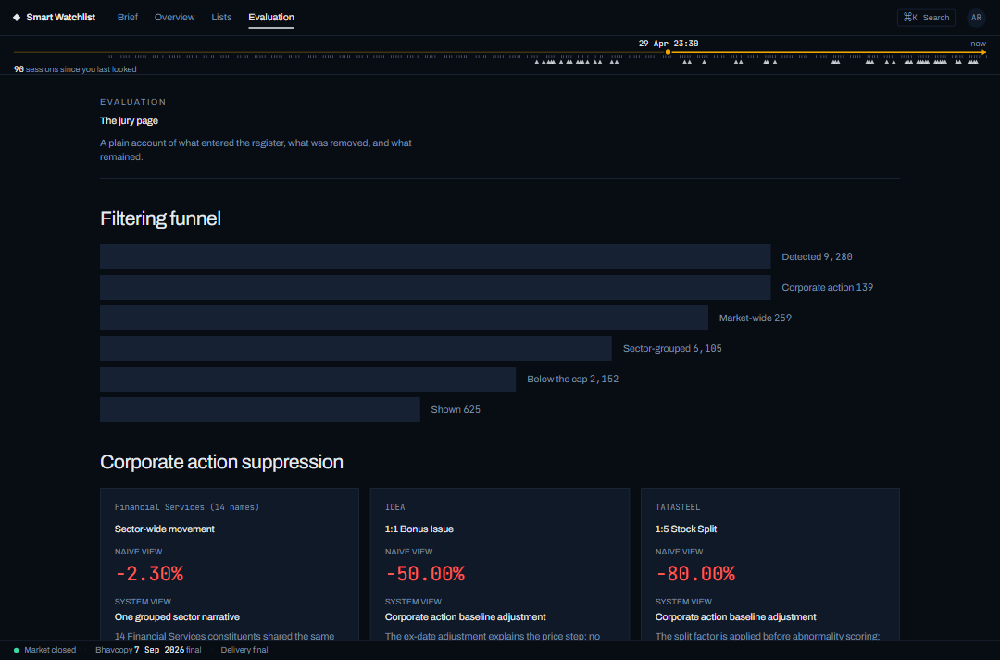

# Smart Market Watchlist — "The Brief"

A watchlist that tells you what changed since you last looked, not what is
blinking right now.

`[ Live: not deployed — no cloud target was stood up for this submission.
Runs locally from a clean clone with no API keys and no network: see "Run it".
· No signup — the demo account opens with one click ]`



<sub>The Brief, with the reading cursor dragged from "now" back three weeks. **This recording is the built-in demo fixture** (`VITE_USE_MOCK=true`, the default for `npm run dev`) — the copy and the fourteen names are a designed walkthrough, not a live pipeline run. The measured numbers further down come from the backend against real NSE data, and `docs/media/eval-funnel.png` below shows that live path. Both are reachable from the same build; "Run it" says how to switch.</sub>

## What this is

The brief asks for three things: create and manage a watchlist, view the
latest market information, and return later and see what changed. Most
watchlist products only really build the first two — a list, and live prices
next to it — and treat "what changed" as a byproduct of staring at the same
numbers again. This build treats "what changed since you last looked" as the
primary surface. The cursor — the timestamp of your last visit — is a
first-class, user-manipulable object, not a hidden implementation detail, and
the product's central screen is a short, ranked, explained list of what
happened since that cursor, not a grid of tickers.

Underneath that screen is an event-study statistics layer, not a rules engine
and not a machine-learning model: a price move only reaches a user after
clearing India's own regulatory bar for a material price movement, then being
tested against the stock's own volatility history with an OLS market model, a
corporate-action suppression path, and a hard per-visit cap. Every number the
system shows is either a regulatory threshold (verifiable against the cited
SEBI circular) or a value tuned against a real replay of 180 trading sessions
of NSE data — the two are never conflated, and the difference is marked
explicitly everywhere it matters, starting with the table below.

Everything past this paragraph is either a number pulled from a real run
against real data, or a decision with its cost stated next to it. The full
reasoning behind each decision is in [`docs/DESIGN.md`](docs/DESIGN.md); the
pre-build specification, unshortened, is in
[`docs/BUILD_SPEC.md`](docs/BUILD_SPEC.md).

## The brief's minimum, and where to see it

| The brief asks for | Where it lives | Code |
|---|---|---|
| Create and manage a watchlist | [`/watchlist/:id`](frontend/src/routes/Watchlist.jsx) | [`frontend/src/routes/Watchlist.jsx`](frontend/src/routes/Watchlist.jsx), [`backend/app/api/watchlist.py`](backend/app/api/watchlist.py) |
| View the latest market information | [`/overview`](frontend/src/routes/Overview.jsx), [`/symbol/:symbol`](frontend/src/routes/Symbol.jsx) | [`frontend/src/routes/Overview.jsx`](frontend/src/routes/Overview.jsx), [`backend/app/api/quotes.py`](backend/app/api/quotes.py) |
| Return later and see what changed | [`/brief`](frontend/src/routes/Brief.jsx) | [`frontend/src/routes/Brief.jsx`](frontend/src/routes/Brief.jsx), [`backend/app/api/brief_explain.py`](backend/app/api/brief_explain.py) |

## The six decisions

| Question | Answer | Detail |
|---|---|---|
| What counts as a meaningful change? | Clearing SEBI's Material Price Movement threshold *and* being statistically unusual for that specific stock — regulatory gate plus event-study layer, neither alone. | [`docs/DESIGN.md` §1](docs/DESIGN.md#1-what-counts-as-a-meaningful-change) |
| What information gets surfaced? | Four fields always: what moved (relative to your cursor), how unusual for this stock, whether there's a disclosed cause, and a freshness stamp — plus a visible budget line stating how many things were looked at versus shown. | [`docs/DESIGN.md` §2](docs/DESIGN.md#2-what-information-to-surface) |
| How does state persist across sessions and devices? | A read cursor merged by `GREATEST()` across devices — a join-semilattice, so no conflict-resolution logic is needed. | [`docs/DESIGN.md` §3](docs/DESIGN.md#3-how-state-persists-across-sessions-and-devices) |
| How is stale, delayed, or conflicting data handled? | Every intraday number is marked provisional and later restated; anything uncertain about a corporate action suppresses that symbol's signal rather than guessing. | [`docs/DESIGN.md` §4](docs/DESIGN.md#4-how-to-handle-stale-delayed-or-conflicting-data) |
| How does the system scale? | Signals are computed once per symbol and joined to users only at read time — the user count never multiplies the compute cost. | [`docs/DESIGN.md` §5](docs/DESIGN.md#5-how-the-system-scales) |
| Where is it simple, and where is it deliberately complex? | Complexity goes to the parts a regulator or a user could reasonably demand we justify by hand (the statistics, the suppression logic); everything else — ranking model, state sync, message transport — takes the simplest option that is provably sufficient. | [`docs/DESIGN.md` §6](docs/DESIGN.md#6-where-to-keep-things-simple-and-where-to-add-complexity) |

**What counts as a meaningful change.** A candidate has to clear the exchange's
own materiality bar (see the threshold table below) *and* register as unusual
against the stock's own 120-session volatility history — a standardised
abnormal return, a turnover z-score, and a logit-transformed delivery
z-score. Clearing the regulatory bar alone is not enough; a stock that moves
5% every few weeks as a matter of course shouldn't interrupt anyone just
because 5% happens to be a legal threshold. The cost: the four weights that
combine those statistics into one score are ours, tuned against a replay
harness rather than handed down by regulation, and one of them — a binary
52-week-extreme flag — is deliberately imprecise, capped at 10% of the total
score specifically so that imprecision cannot dominate the result.

**What information gets surfaced.** Every item states what moved relative to
your own last-visit cursor, how unusual that is for this specific stock (not
the market), whether a filing explains it, and how fresh the number is. The
response also always states a budget — candidates detected, how many were
suppressed and why, how many were shown — rendered on screen, not buried in a
log. The cost: no charts on the primary screen and no push notifications; a
user who wants a chart is one click away at the symbol page, and the FCA's own
notification-harm findings (cited below) are the reason push was never built
at all.



<sub>`/overview` — the "latest market information" surface. Benchmark cards, the
watchlist equal-weighted and rebased to 100 against Nifty 50 over the cursor's
own period, the attention budget reconciled on the left, and sector attribution
on the right. Colour here carries data confidence, not direction; the live
watchlist table at `/watchlist/:id` is the one surface that uses red and green
for direction, because fighting that convention there helps nobody.</sub>

**How state persists across sessions and devices.** A single per-user, per-scope
cursor merges across devices with `GREATEST()` — provably sufficient because a
timestamp under a max operation is a join-semilattice, the same shape Matrix's
private read-receipts extension and Slack's own cross-device sync independently
converged on. The cost: this buys correctness for concurrent *reads* of state
cheaply, but the idempotency-key replay path that would make a retried
*write* safe from double-application is implemented on the server and not yet
wired up on the client — a real, stated gap, not a hidden one.

**How stale, delayed, or conflicting data is handled.** Intraday numbers are
shown but explicitly marked provisional until the exchange's end-of-day files
land, then restated in place. Anything the system cannot verify about a
corporate action — an unparsed purpose string, or a parsed factor that
disagrees with the price the market actually printed — suppresses that
symbol's signal rather than showing a number the system itself doesn't trust.
The cost: real signals get suppressed alongside artefacts, on purpose, because
the alternative failure (a phantom crash shown with confidence) is worse; see
the NARMADA case below for a real instance of this rule catching a bug in our
own pipeline.

**How the system scales.** Users outnumber symbols by three to four orders of
magnitude — Groww's own reported 13.12 million active NSE clients (cited below)
against the 2,584 instruments in this build's symbol master, of which NSE's own
investable-universe index list classifies 755. Whichever of those you take as
the denominator, every signal is computed
once per symbol and joined to a user's watchlist only when that user actually
asks for a Brief. The cost: this is a read-time architecture, which means the
one place per-user cost cannot be fully avoided — live price streaming — is
bounded instead, by viewport-scoped subscriptions, a 400ms conflation window,
and a hard per-connection cap, rather than eliminated.

**Where it's simple versus complex.** The statistics that decide what gets
suppressed and how something is ranked are transparent, inspectable,
deterministic — no learned model touches that path, because on day one there
is no label to train one on, and an unexplainable ranker on a surface that
measurably moves retail trading behaviour (again, the FCA's finding) is a
liability. The cost: a from-scratch statistical model needed real engineering
— an OLS market model, winsorization, a logit-transformed bounded z-score —
that a pretrained or off-the-shelf anomaly detector would have skipped, and
that engineering is where most of this submission's complexity actually went.

## Where the numbers come from

The Material Price Movement thresholds are SEBI's, not ours — copied verbatim
from the 21 May 2024 circular under LODR Regulation 30(11) and never tuned:

| Price tier | Threshold | Source |
|---|---|---|
| Under ₹100 | 5% | [SEBI MPM circular, May 2024](https://vinodkothari.com/2024/05/amendment-in-market-rumour-2024/) · [NSE circular text](https://nsearchives.nseindia.com/content/circulars/SURV62122.zip) |
| ₹100–200 | 4% | same circular |
| Above ₹200 | 3% | same circular |

A move within 1 percentage point of the benchmark index's own move on the day
(`MPM_INDEX_ADJUST_MIN_PCT = 1.0`) does not automatically qualify — that
figure, and everything past the regulatory gate, is `[TUNED]`: the ranking
weights (`W_SCAR = 0.45`, `W_TURNOVER = 0.25`, `W_DELIVERY = 0.20`,
`W_EXTREME = 0.10`), the market-attribution ratio (`0.70`), the sector
peer-grouping threshold (`SECTOR_MIN_PEERS = 3`), and the corporate-action
verification tolerance (`CA_VERIFY_TOLERANCE = 0.08`) are all ours, arrived at
by running the eval harness against real data, not handed down by regulation.
Every constant in the codebase, tagged `[REGULATORY]` or `[TUNED]`, lives in
one file: [`backend/app/constants.py`](backend/app/constants.py).

## What we measured

Real output from `app/eval/replay_runner.py` against 200 liquid NSE symbols
over 126 real trading sessions, re-run 2026-09-08 after fixing the
`DISCREPANCY`-suppression bug described below (`.cache_clear()` was called
first — this is not a cached stale number):

```
9,280 candidate-or-notice events evaluated
  139 (1.5%)  suppressed as corporate-action artefacts
  259 (2.8%)  rolled up as market-wide
6,105 (65.8%) grouped as sector-wide
2,152 (23.2%) would have surfaced but lost to the per-visit cap
  625 (6.7%)  actually surfaced
```



<sub>The same funnel rendered at `/eval`, running against the live backend
(`VITE_USE_MOCK=false`) — the counts on screen are the ones tabulated above,
read from the API rather than retyped. The three cards below the funnel are the
suppression cases: a Financial Services sector move at −2.30%, IDEA's 1:1 bonus
at a naive −50.00%, and TATASTEEL's 1:5 split at a naive −80.00%, each shown
next to what the system says instead.</sub>

**The continuation test.** Forward 5-session, market-model-adjusted abnormal
return for every surfaced signal, grouped by whether a filing explained it,
using each candidate's own held-constant beta:

| Classification | n | mean 5-session AR | median | % same direction as the original move |
|---|---:|---:|---:|---:|
| Explained by filing | 3,645 | +0.85% | +0.26% | 53.2% |
| Unexplained | 5,188 | +0.80% | +0.20% | 54.9% |

Boudoukh, Feldman, Kogan & Richardson (NBER 18725) predict continuation on
identified-news days and reversal on extreme moves with no identified cause —
a gap between these two rows would have been the empirical validation of this
system's own ranking criterion. **It did not reproduce that gap.** Explained
and unexplained candidates continued at nearly identical rates over this
window, on this data. Reported honestly rather than adjusted to look better:
either five sessions is too short a horizon for the effect Boudoukh et al.
measured, or the effect is real in US equities and weaker or absent in this
slice of NSE cash-equity data, or the classification (filing-linked vs. not)
is too coarse a proxy for their "identified vs. unidentified" distinction. We
did not investigate further — flagged here as a real, open question rather
than a footnote.

**Parser coverage**, from `python -m app.ingest.coverage`, run against the
full backfilled history:

| | rows | share |
|---|---:|---:|
| Corporate actions parsed to a usable factor | 1,930 of 2,023 | 95.4% |
| — of which the market-observed gap matched | 1,922 | 95.0% |
| — of which the factor was inferred from the price gap alone | 8 | 0.4% |
| Corporate actions left unparsed, suppressed | 83 | 4.1% |
| Corporate actions flagged discrepant, suppressed | 10 | 0.5% |
| Announcements resolved by the exchange's own `desc` field | 45,135 of 177,779 | 25.4% |
| Announcements resolved by a subject-line regex fallback | 2,037 | 1.1% |
| Announcements left as `OTHER` | 130,607 | 73.5% |

The 73.5% `OTHER` figure is not a hidden gap: it means three-quarters of raw
NSE filings never get a specific category, so they can still be *linked* to a
signal (an `EXPLAINED` classification only needs a filing to exist on the
right date) but cannot get the stronger `MULT_EXPLAINED_A = 1.35` multiplier
reserved for a recognised high-materiality category like financial results or
an M&A disclosure — they get the weaker `1.15`.

Backend test suite: **617 passed, 1 skipped, 0 failed** (`python -m pytest` in
`backend/`, about 6m40s — it runs against a real Postgres). Frontend `npm test`
chains three checks and all pass: the prohibited-pattern scan, ESLint, and
**15 unit tests, 0 failed**.

## What's wrong with it

Five real cases, found by querying the live database rather than reasoning
about the design in the abstract — volunteering these is a stronger position
than waiting for a reviewer to find them:

1. **`LIQUIDCASE`/`LIQUIDBEES`, 2026-07-03** — turnover z-score of ~5.1 on two
   liquid-fund ETFs whose NAV moved essentially 0%. Turnover clears its
   candidate floor independently of price, so a pure volume spike on an
   instrument that structurally never moves in price still generates a
   candidate; it ranks low but is not suppressed outright.
2. **`ESDS`, 2026-09-07** — a candidate with `n_obs = 0` in its market-model
   window (`quality_flag = 'DEGRADED'`, beta forced to 1.0) still produced
   `sar = 8.78`, an extreme value from a model that had no real observations
   to estimate from. The degraded flag exists and is visible in the explain
   endpoint, but nothing downstream currently discounts the score for it.
3. **The "Financial Services" sector bucket, 1,876 candidates over the eval
   window** — NSE's own sector taxonomy groups banks, NBFCs, insurers, and
   asset managers under one label, so the sector-wide rollup can genuinely
   conflate a bank-specific event with an unrelated NBFC-driven sector move
   that happens to share a sign and magnitude.
4. **`WIPRO`'s buy-back, ex-date 2026-06-05** — its purpose string ("Buy
   Back") has no ex-date price-adjustment rule in our parser
   (`verification = 'UNPARSED'`, one of 31 identical rows), so it is excluded
   from the suppression registry entirely. Any abnormal move near that date
   would surface unexplained rather than pointing at the buy-back.
5. **`ENRIN`, 2026-08-07** — `delivery_z = -10.29` alongside `turnover_z =
   10.53`, the textbook signature of a price spike with no real buying
   conviction behind it. The ranker only credits *high* delivery
   (`max(0.0, delivery_z)`), so this extreme-low reading contributed exactly
   zero to the score — a real scoring gap, not a display issue.

**Scope, stated plainly.** NSE cash equity only (EQ/BE/BZ series) — no BSE, no
derivatives, no mutual funds beyond the two ETFs above slipping through the
universe filter. Single region, single write path, no failover. Sector
classification tops out at 94.9% coverage because NSE itself publishes no
sector file covering its full equity universe (`docs/DESIGN.md`, and
`docs/data-notes.md`, have the full measurement). Announcement categorisation
resolves 26.5% of raw filings to a specific business category; the rest are
still linkable to a signal but not to a materiality multiplier.

## What we deliberately did not build

**A learned ranker.** There is no interaction data on day one, so any
submission's "ML ranker" is either trained on an invented label or is
quietly predicting forward returns — which, on a retail brokerage surface, is
an unregistered advice engine, not a watchlist. The ranking here is
transparent event-study statistics end to end, inspectable through
`/api/brief/explain/{id}`. Full reasoning, including the v2 this becomes if
real interaction data ever exists: [`docs/DESIGN.md` §6](docs/DESIGN.md#6-where-to-keep-things-simple-and-where-to-add-complexity).

**CRDTs for cross-device sync.** The read cursor is a max over a total order —
already a join-semilattice — and the watchlist has one writer and near-zero
real concurrency. CRDT tombstone growth and merge metadata solve a
multi-writer problem this system does not have. [`docs/DESIGN.md` §3](docs/DESIGN.md#3-how-state-persists-across-sessions-and-devices).

**Kafka.** Redis Streams with consumer groups already gives ordered,
replayable, per-symbol delivery at this scale, behind a consumer interface
abstracted specifically so a future swap is a class change, not a rewrite.
[`docs/DESIGN.md`, "How it scales"](docs/DESIGN.md#how-it-scales).

**Custom charting.** An existing library is the same call Groww made building
their own real-time terminal; effort spent reimplementing candlesticks is
effort a reviewer has no way to credit over spending it on the statistics
layer instead. [`docs/DESIGN.md` §6](docs/DESIGN.md#6-where-to-keep-things-simple-and-where-to-add-complexity).

## Run it

**Live: there is no hosted URL.** Clicking a link is the fastest way for a
reviewer to judge a project, and this submission does not offer one — the time
went into real data and a real evaluation harness instead of provisioning
hosting. The cost is real and it is ours: evaluating this means cloning it.

**Locally** the setup is a clone and three commands, with no API keys and no
network access required. The repository carries its own NSE data — 1,097
cached exchange files, about 276 MB — so `make seed` reproduces the database
this README's numbers came from without touching the internet. Note the clone
size before you start.

Budget roughly fifteen minutes for `make seed` on first run: it ingests the
cached files and then computes adjustment factors, market-model baselines and
candidates for the full universe, which took about ten and a half minutes of
that on the machine this was built on. It is a one-time cost; the app starts
instantly afterwards.

```bash
git clone https://github.com/IndiraTejaswini/Smart-Watchlist
cd Smart-Watchlist
make env            # creates .env from .env.example
make up             # starts postgres + redis in Docker
make seed           # offline: loads cached NSE data, computes baselines and candidates
cd backend && python -m uvicorn app.main:app --reload   # API on :8000
```

In a second terminal:

```bash
cd frontend
npm install
npm run dev          # dev server on :5173
```

Open `http://localhost:5173` and click **Open the demo account** — no
credentials needed.

**Two data paths, and which one you are looking at.** `npm run dev` ships with
`VITE_USE_MOCK=true` in `frontend/.env.development`, which serves the designed
demo fixture — the walkthrough in the recording at the top of this file. It is
a fixture: the names and the copy are authored, and its budget line reads "41
changes, showed you 4," which is the demo's own story and not the measured
funnel in "What we measured."

To see the real pipeline — the 9,280-event funnel, the live scoring, the
LIQUIDBEES false positive at rank 1 — run the frontend against the backend
instead:

```bash
cd frontend
VITE_USE_MOCK=false npm run dev          # bash / zsh
```

```powershell
cd frontend
$env:VITE_USE_MOCK="false"; npm run dev  # PowerShell — this repo was built on Windows
```

Every route works either way; `/eval` is the clearest place to see the
difference, because it renders the funnel counts the backend actually computed.
`docs/DEMO_WALKTHROUGH.md` has a route-by-route tour through `/brief`,
`/overview`, `/watchlist/:id`, `/symbol/:symbol`, and `/eval`.

**Verification commands**, if you want to check the numbers above yourself
rather than take them on faith:

```bash
cd backend  && python -m pytest -q                      # 617 passed, 1 skipped
cd frontend && npm test                                 # prohibitions + eslint + 15 unit tests
cd backend  && python -m app.ingest.coverage --no-readme  # the parser-coverage table above
```

The backend suite needs `make up` (Postgres reachable) but not `make seed` — it
creates its own test database and runs the migrations itself, and skips with a
message rather than failing if Postgres is not up. It talks to a real Postgres
rather than a fixture double, which is why it takes minutes rather than
seconds.

## References

**Investor attention**
- Barber & Odean, "All That Glitters," *RFS* 21(2), 2008 — https://academic.oup.com/rfs/article-abstract/21/2/785/1607197
- Gargano & Rossi, "Does It Pay to Pay Attention?" *RFS* 31(12), 2018 — https://papers.ssrn.com/sol3/papers.cfm?abstract_id=2846149
- Boudoukh, Feldman, Kogan & Richardson, "Which News Moves Stock Prices?" NBER 18725 — https://www.nber.org/papers/w18725

**Regulatory evidence on notification design**
- FCA Occasional Paper 66, digital engagement practices — https://www.fca.org.uk/publication/occasional-papers/op66-digital-engagement-practices-investment-outcomes.pdf
- FCA research note, trading-apps experiment — https://www.fca.org.uk/publications/fca-research/research-note-digital-engagement-practices-trading-apps-experiment

**SEBI and Indian market structure**
- Material Price Movement framework, threshold table — https://vinodkothari.com/2024/05/amendment-in-market-rumour-2024/ · NSE circular: https://nsearchives.nseindia.com/content/circulars/SURV62122.zip
- Reg 30 / Schedule III thresholds and timelines — https://www.assocham.org/uploads/files/ISF%20Reg%2030%20Note.pdf

**Scale context**
- Groww Engineering, "Building 915" — https://tech.groww.in/building-915-inside-growws-high-performance-trading-terminal-d2f05c46a9c7
- Groww 28.9% NSE market share, July 2026 — https://www.whalesbook.com/news/English/brokerage-reports/Groww-Market-Share-Hits-289percent-in-July-2026-Beats-Peers/6a82aa636ffbe1e6461f0735

**Cursor and state-sync precedent**
- Matrix MSC2285, private read receipts — https://github.com/freenet/river/issues/460

**Further reading in this repository**
- [`docs/DESIGN.md`](docs/DESIGN.md) — the six decisions, in full, plus scaling, failure modes, and everything considered and rejected.
- [`docs/BUILD_SPEC.md`](docs/BUILD_SPEC.md) — the full pre-build specification, unshortened.
- [`docs/data-notes.md`](docs/data-notes.md) — dated, measured discoveries about NSE's own data quirks (stale holiday responses, sector-file gaps, corporate-action parsing traps), each with the actual measurement behind it.
- [`docs/DEMO_WALKTHROUGH.md`](docs/DEMO_WALKTHROUGH.md) — a route-by-route tour for a first-time reviewer.
